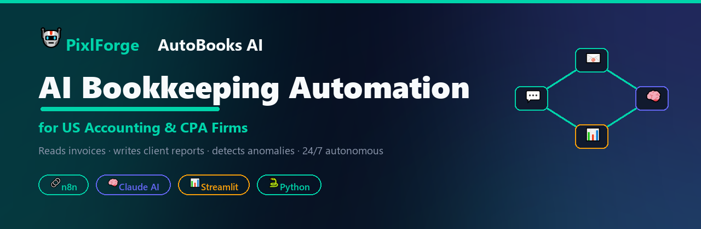
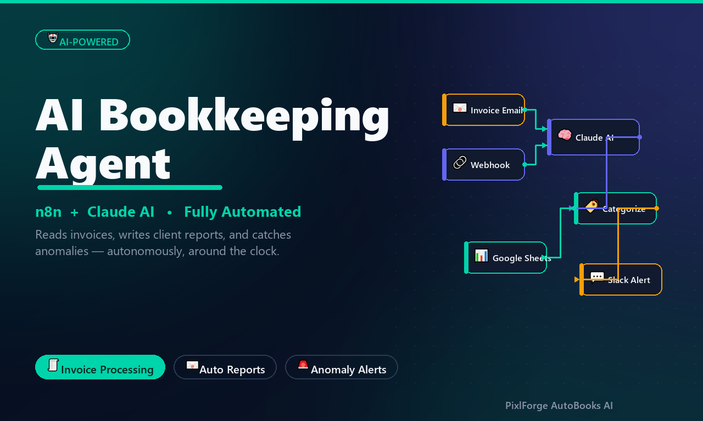
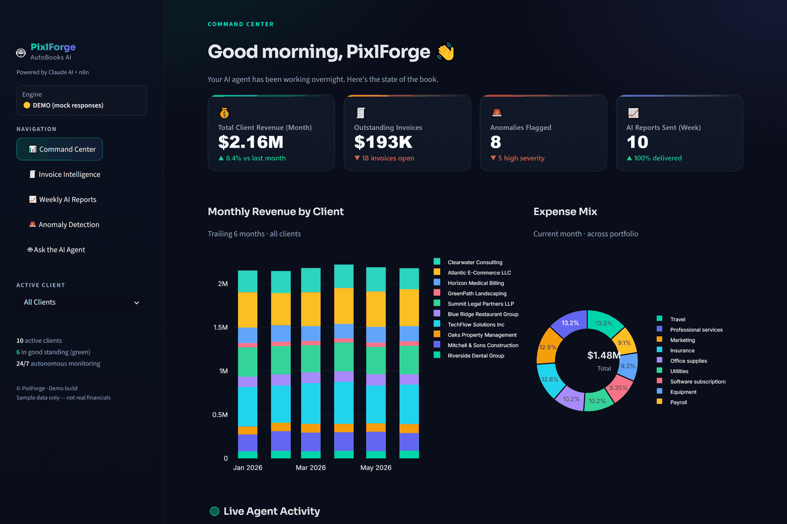
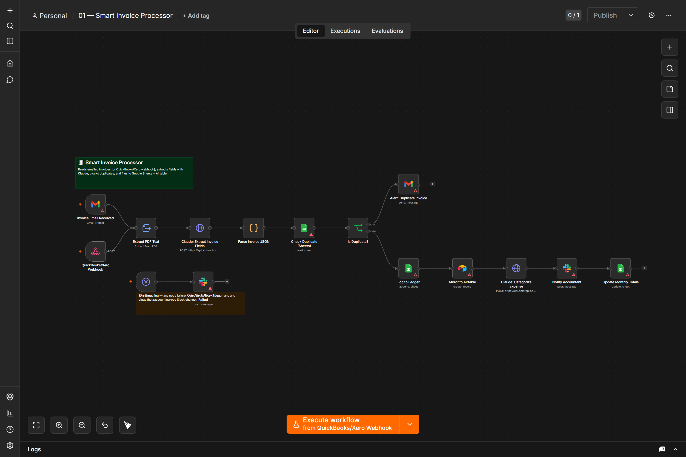
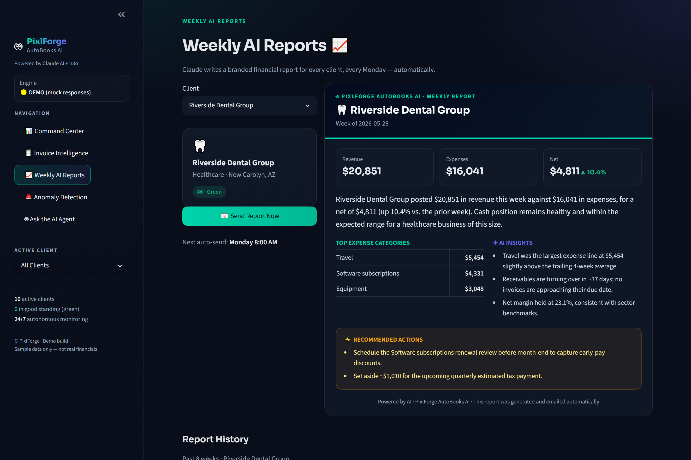
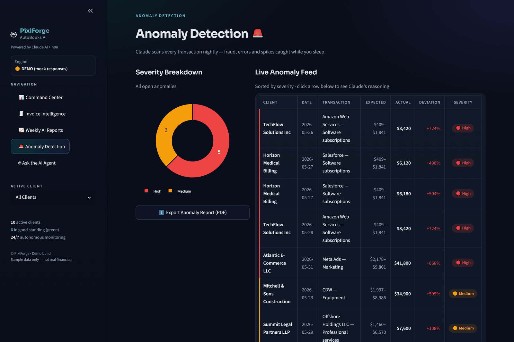
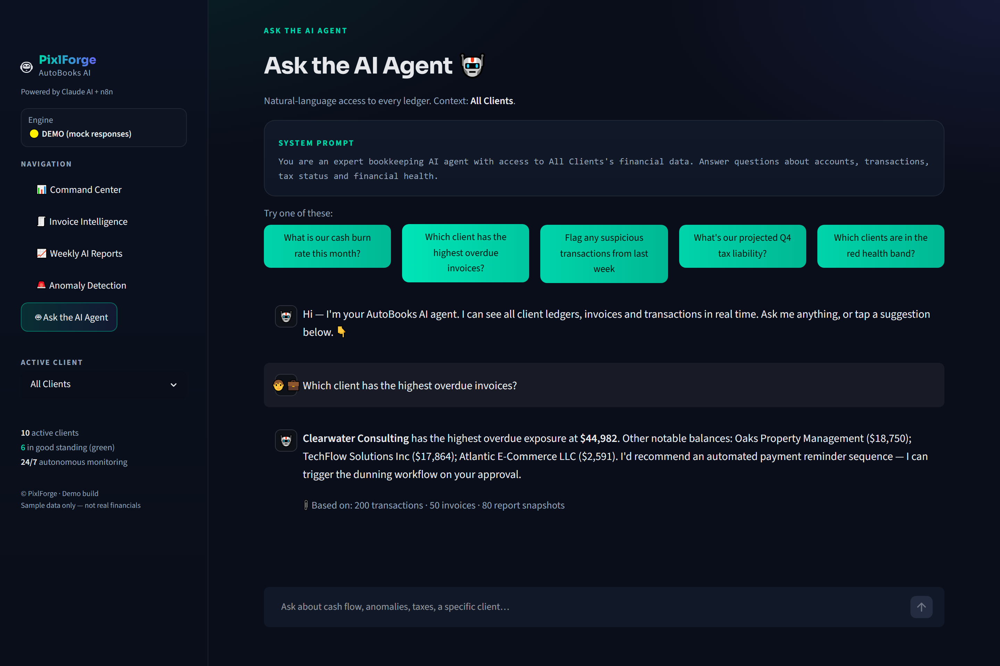
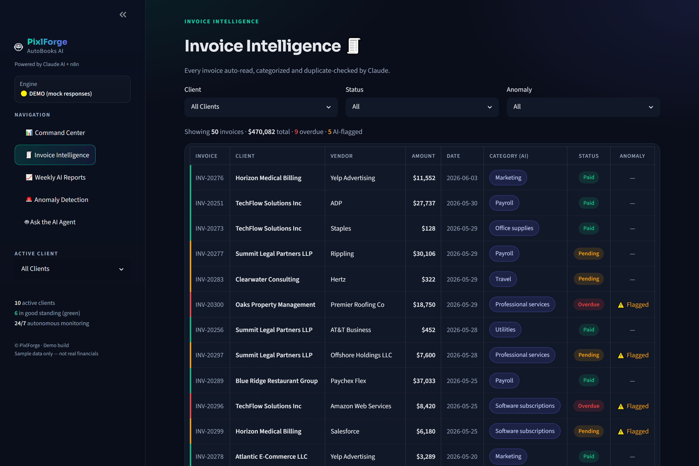

<!-- PixlForge AutoBooks AI — README -->

<p align="center">
  
</p>

<h1 align="center">PixlForge AutoBooks AI</h1>
<p align="center"><b>An autonomous AI bookkeeping agent for US accounting & CPA firms.</b><br>
Reads invoices · writes weekly client reports · detects anomalies · onboards clients · tracks tax readiness — <b>24/7</b>.</p>

<p align="center">
  
  
  
  
  
  
  
</p>

---

## 📌 Overview

Bookkeeping and CPA firms lose **10–20 hours every week** to repetitive manual work — keying
invoices, chasing receipts, writing client updates and eyeballing transactions for errors.

**PixlForge AutoBooks AI** is a fleet of **5 connected automations** that run around the clock.
[Anthropic **Claude**](https://www.anthropic.com) handles the judgement-heavy steps (extraction,
classification, anomaly reasoning, report writing) while self-hosted **n8n** orchestrates the
integrations firms already use — QuickBooks, Xero, Google Sheets, Gmail and Slack.

> 💡 **The business case:** `15 hrs/week × $50/hr × 4.33 weeks ≈ $3,250 saved every month` — the
> engagement typically pays for itself in the first month, then runs autonomously.

<p align="center">
  
</p>

---

## ✨ What it can do (benefits)

| | Benefit |
|---|---|
| 🧾 | **Zero-touch invoice entry** — emailed invoices are read, categorized and filed automatically, with duplicates blocked before they’re paid. |
| 📈 | **Effortless client reporting** — branded weekly financial reports written by AI and emailed every Monday. |
| 🚨 | **Always-on fraud & error detection** — nightly anomaly scans catch spikes, new vendors and double-payments. |
| 🤝 | **Instant client onboarding** — a web form spins up a profile, welcome email, Slack channel and check-in. |
| 🧮 | **No more tax-season scramble** — per-client readiness scores flag missing items early. |
| 🔒 | **Your data stays yours** — self-hosted by default; nothing has to leave the client’s infrastructure. |

---

## 📸 Real screenshots

> These are **live captures** from the running Streamlit dashboard and the actual n8n editor — not mockups.

<table>
  <tr>
    <td width="50%"><br><sub><b>Command Center</b> — KPIs, revenue & expense analytics, live AI activity log</sub></td>
    <td width="50%"><br><sub><b>n8n workflow</b> — the Smart Invoice Processor, fully connected</sub></td>
  </tr>
  <tr>
    <td width="50%"><br><sub><b>Weekly AI Report</b> — branded, Claude-written client report</sub></td>
    <td width="50%"><br><sub><b>Anomaly Detection</b> — severity-scored feed with AI explanations</sub></td>
  </tr>
  <tr>
    <td width="50%"><br><sub><b>Ask the AI Agent</b> — natural-language Q&A over the ledgers</sub></td>
    <td width="50%"><br><sub><b>Invoice Intelligence</b> — AI-tagged, duplicate-checked, color-coded</sub></td>
  </tr>
</table>

---

## ⚙️ The 5 automations

| # | Workflow | What it does |
|---|----------|--------------|
| 1 | **Smart Invoice Processor** | Email/webhook → Claude extracts vendor, amount, date & tax → duplicate check → logs to Sheets + Airtable → categorizes → notifies the accountant. |
| 2 | **Weekly AI Client Report** | Every Monday 8 AM → loops clients → computes revenue/expense/net → Claude writes a branded summary + 3 insights + 2 recommendations → emails it → logs it. |
| 3 | **AI Anomaly Detection** | Nightly → compares last 24 h vs. 90-day baseline → Claude flags spikes / new vendors / duplicate payments with a severity score → priority alert. |
| 4 | **New Client Onboarding** | Web form → creates profile → Claude writes a personalized welcome → email + checklist + Slack channel + 7-day check-in. |
| 5 | **Tax Season Readiness** | Monthly → checks missing receipts & uncategorized txns → Claude scores readiness 0–100 → flags high-risk clients before deadlines. |

Each workflow is a **valid, importable `n8n` JSON** with error-handling lanes and fully-configured Claude API nodes.

---

## 🚀 Innovative features (industry-first)

- **AI Client Health Score™** — a weekly 0–100 score per client blending payment timeliness, expense growth, cash-flow stability and anomaly history.
- **Duplicate Invoice Neural Detection** — semantic matching catches the *same* invoice re-billed with a slightly different amount or date.
- **Tax Season Readiness Radar** — per-client quarterly readiness % with the exact missing items flagged.
- **Smart Vendor Fingerprinting** — learns each client’s known vendors and auto-flags new/unknown ones for approval.
- **Natural-Language Financial Q&A** — “which clients spiked >20% this month?” answered in seconds. No SQL, no pivot tables.
- **Multi-Software Auto-Sync** — QuickBooks, Xero, Wave, FreshBooks + Google Sheets. Clients keep the tools they already use.

---

## 🏆 Why this is best-in-class

- ✅ **Real, not tutorial-grade** — the n8n workflows import and run; the dashboard is a production-quality Streamlit app.
- ✅ **AI where it matters** — Claude does the reasoning; n8n does the plumbing. Clean separation, production patterns.
- ✅ **Runs with zero setup** — full **DEMO/mock mode** means anyone can try it without an API key or cost.
- ✅ **Privacy-first** — self-hosted; secrets in `.env`/credentials; Anthropic doesn’t train on API data.
- ✅ **Complete deliverable** — workflows, dashboard, branded emails, sample data, PDF report and docs.

---

## 🧰 Tech stack

<p>
  
  
  
  
  
  
  
  
  
</p>

| Layer | Tool |
|---|---|
| Automation engine | n8n (self-hosted) |
| AI / reasoning | Anthropic Claude (`claude-sonnet-4`) |
| Dashboard | Streamlit + Plotly |
| Data store | Google Sheets (demo) / Airtable (prod) |
| Email / alerts | Gmail · SendGrid · Slack |
| Reports & assets | ReportLab (PDF) · Pillow (thumbnails) |

---

## 📂 Project structure

```
bookkeeping-ai-agent-demo/
├── n8n-workflows/      5 importable n8n workflow JSONs (+ builder)
├── dashboard/          Streamlit app (5 tabs, theme, components)
├── sample-data/        realistic US data generator + JSON
├── email-templates/    3 branded HTML emails
├── fiverr-assets/      thumbnails, banner, screenshots (+ generators)
├── fiverr-report/      portfolio PDF (+ generator)
├── assets/             README visuals
├── README.md · SETUP.md · .env.example · LICENSE
```

## ▶️ Quick start

```bash
# 1) sample data
python sample-data/generate_data.py

# 2) dashboard (DEMO mode — no API key needed)
cd dashboard && pip install -r requirements.txt && streamlit run app.py

# 3) n8n — import any file from /n8n-workflows
npx n8n start
```

For live Claude responses, copy `.env.example` → `.env` and set `ANTHROPIC_API_KEY`.
Full client-deployment guide in **[SETUP.md](SETUP.md)**.

> 🔒 **Note:** This public repository is a **showcase**. The complete, production source is
> maintained privately and delivered as part of an engagement.

---

## 👋 About PixlForge

PixlForge designs production-grade AI automation for finance, accounting and operations teams.

- 📧 **Email:** [pixlforge.studio03@gmail.com](mailto:pixlforge.studio03@gmail.com)
- 🌐 **Portfolio:** [pixlforgestudio03.netlify.app](https://pixlforgestudio03.netlify.app/)
- 💼 **LinkedIn / Connect:** (www.linkedin.com/in/naman-jain-a41893266)

> 💬 Want this for your firm? **Message me for a free workflow audit** — I’ll map your current
> process and recommend exactly which automations to start with.

---

## 📜 License

See **[LICENSE](LICENSE)**. This is a portfolio / demo project — free to view and evaluate, not for
redistribution or resale. Commercial deployment is available as a service engagement.

---

<p align="center">
  <sub>⚡ Built with full focus and production discipline · <b>Developed by Naman Jain</b> · © PixlForge</sub>
</p>
